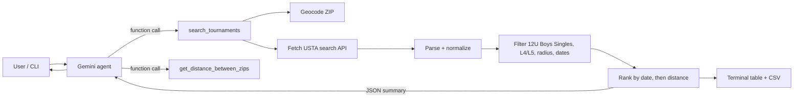

# 🎾 USTA Tournament Agent

An AI agent (Google Gemini + Python tools) that finds **USTA junior tournaments** matching:

- **Division:** Boys 12 & Under (12U) **Singles**
- **Levels:** **L4** and **L5**
- **Location:** within **200 miles** of ZIP **30022** (Alpharetta / Johns Creek, GA)
- **Window:** next **6 months**
- **Order:** by **date**, then by **proximity** (or `--sort distance`)

Results are printed as a table in the terminal and saved to a CSV file.

## How it works



- **The agent** (`usta_agent/agent.py`) is an LLM with a system prompt and **tools**. It decides when to
  call them, then summarizes the results in plain English. Follow-up questions work in chat mode
  (e.g. *"only Level 4 within 100 miles"*).
- **The tools** (`usta_agent/tools.py`) are deterministic Python. The LLM never invents data.
  The table and CSV come straight from the code.
- **USTA client** (`usta_agent/usta_client.py`) queries the same JSON search endpoint used by
  [playtennis.usta.com/tournaments](https://playtennis.usta.com/tournaments).
- **Filters** (`usta_agent/filters.py`) check each event's gender, age group (12U), and format (singles),
  and each tournament's level, distance (haversine), and date.

## Project structure

```
.
├── main.py                    # CLI entry point
├── requirements.txt
├── pyproject.toml             # pytest config
├── .env.example               # copy to .env and add your Gemini key
├── data/
│   └── sample_response.json   # offline sample data (for demo + tests)
├── usta_agent/
│   ├── __init__.py
│   ├── agent.py               # Gemini agent (system prompt + tool calling)
│   ├── tools.py               # tools the agent can call
│   ├── usta_client.py         # USTA search API client + parser
│   ├── filters.py             # 12U boys singles / level / radius / date logic
│   ├── geo.py                 # ZIP -> lat/lon, haversine distance
│   ├── models.py              # dataclasses
│   └── output.py              # terminal table + CSV
└── tests/
    └── test_agent.py          # pytest unit tests
```

## Setup

Requires **Python 3.10+**.

```bash
git clone https://github.com/<your-username>/usta-tournament-agent.git
cd usta-tournament-agent
python -m venv .venv
source .venv/bin/activate          # Windows: .venv\Scripts\activate
pip install -r requirements.txt
cp .env.example .env               # then put your key in .env
```

Get a free Gemini API key at <https://aistudio.google.com/apikey>.

## Usage

```bash
python main.py                     # agent run with the default criteria
python main.py --chat              # interactive chat with the agent
python main.py --no-llm            # skip the LLM, just print the table + CSV
python main.py --sample            # use offline sample data (no live USTA request)
python main.py --sort distance     # closest first
python main.py --radius 100 --months 3 --levels 4
```

| Flag | Default | Description |
|------|---------|-------------|
| `--zip` | `30022` | ZIP code to measure distance from |
| `--radius` | `200` | Max distance in miles |
| `--months` | `6` | Months ahead to search |
| `--levels` | `4,5` | USTA junior levels to include |
| `--sort` | `date` | `date` or `distance` |
| `--csv` | `results/tournaments_12u_boys.csv` | CSV output path |
| `--sample` | off | Use offline sample data |
| `--no-llm` | off | Run without Gemini |
| `--chat` | off | Interactive chat mode |

If no `GEMINI_API_KEY` is set, the program automatically falls back to `--no-llm` mode.

### Example output (`python main.py --sample --no-llm`)

```
|   # | Start      | Level   |   Miles | Tournament                       | Location        |
|-----|------------|---------|---------|----------------------------------|-----------------|
|   1 | 2026-10-17 | L5      |     1.9 | Johns Creek Fall L5 Junior Open  | Johns Creek, GA |
|   2 | 2026-11-07 | L4      |    17.3 | Atlanta Winter Classic L4        | Atlanta, GA     |
|   3 | 2026-11-07 | L4      |    92.9 | Chattanooga Riverfront L4 Junior | Chattanooga, TN |
|   4 | 2027-01-16 | L5      |   151.6 | Birmingham Spring Junior L5      | Birmingham, AL  |

Saved 4 result(s) to results/tournaments_12u_boys.csv
```

*(Sample dates shift relative to today's date, so yours will differ.)*

## Tests

```bash
pytest -v
```

The tests use the offline sample data. It includes tournaments that should be excluded
(Level 3, girls-only, doubles-only, too far away), so the filters are actually exercised.

## Notes & limitations

- USTA does **not** publish an official public API. This project uses the JSON endpoint behind the
  PlayTennis tournament search. If USTA changes it, open the search page in Chrome, go to
  **DevTools → Network**, run a search, and update `SEARCH_URL` / `build_payload()` in
  `usta_agent/usta_client.py` to match the `Query` request. Parsing is defensive and handles
  several field-name variations.
- Distance is straight-line (haversine), not driving distance.
- Always confirm entry deadlines, draw details, and eligibility on playtennis.usta.com.
- Please be respectful of USTA's servers and terms of use. The agent makes only a few paged requests per search.
